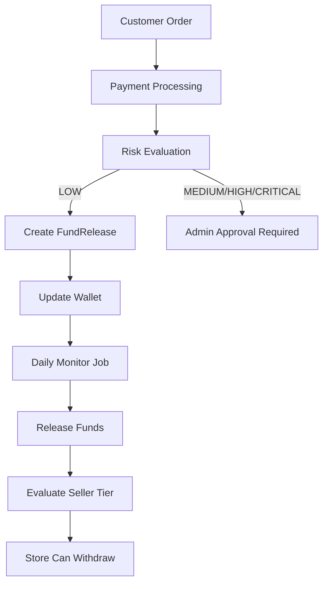

# Phase 2 Complete System Integration

**How Risk, Disputes, and Tiers Connect to Phase 1**

---

## Complete Flow: From Order to Fund Release

### STEP 0: Customer Places Order

Order #5000 created

---

### STEP 1: Payment Processing

- **Payment Status:** PENDING → SUCCESS
- Payment gateway confirms ✓
- All SubOrders ready for settlement

---

### PHASE 2: Risk Evaluation

**New Decision Point**

---

### STEP 2A: Evaluate Risk Score

For each SubOrder, call: `evaluateOrderRisk()`

**Input Data:**

- Seller: SellerTier (NEW/TRUSTED/VERIFIED/PREMIUM)
- Order: Amount, items, delivery address
- Buyer: Purchase history, chargeback count
- Payment: Method type (card vs bank transfer)

**Risk Factors Checked:**
| Risk Factor | Points | Condition |
|------------|--------|-----------|
| NEW_SELLER | 15 | Seller < 30 days |
| HIGH_CHARGEBACK_RATE | 20 | Seller >2% chargebacks |
| UNVERIFIED_SELLER | 12 | No KYC docs approved |
| HIGH_ORDER_VALUE | 14 | Order > ₦500k |
| FIRST_PURCHASE_BUYER | 8 | Buyer new to platform |
| HIGH_RISK_PAYMENT | 7 | Prepaid/debit card |

**Output: RiskIndicator**

- `riskScore`: 0-100
- `overallRiskLevel`: LOW | MEDIUM | HIGH | CRITICAL
- `actionRequired`: NONE | MONITOR | REVIEW | HOLD | BLOCK

**Example:**

- NEW seller + HIGH order value + FIRST-TIME buyer
- Score: 15 + 14 + 8 = 37 (MEDIUM risk)
- Action: MONITOR

---

### Admin Approval Check

- **Question:** Is `actionRequired = BLOCK` or `REVIEW`?
  - **Yes:** Admin approval required (1-24 hours)
  - **No:** Proceed to Phase 1 logic

---

### STEP 2B: Determine Hold Duration

- SellerTier benefits:
  - NEW: 72 hours
  - TRUSTED: 48 hours
  - VERIFIED: 24 hours
  - PREMIUM: 12 hours

- Risk adjustment:
  - MEDIUM risk: +24 hours
  - HIGH risk: +72 hours
  - CRITICAL risk: +14 days

**Example:**

- TRUSTED seller (48 hrs) + MEDIUM risk (+24 hrs) = 72 hours total hold

---

### PHASE 1: Fund Release Creation (Updated with Risk Adjustments)

**STEP 3: Create FundRelease for each SubOrder**

- Includes `RiskIndicator` link
- FundRelease created with:
  - Amount info: gross, commission, net
  - Seller tier benefits applied
  - Risk-adjusted hold duration
- Initial conditions:
  - `paymentCleared = true`
  - `deliveryConfirmed = false`
  - `returnWindowExpired = false`
  - `businessDaysElapsed = false`
  - `riskHoldExpired = false`
  - `noDisputes = false`

- **Status:** PENDING
- **Target Release Date:** NOW + businessDaysElapsed + riskHoldDuration

---

### STEP 4: Wallet Updated - Funds in Escrow

- **Store's Wallet:**
  - `wallet.pending += netAmount`
  - `wallet.balance` stays 0

- **Wallet Transaction:**
  - Type: CREDIT
  - Source: ORDER
  - Description: `"Order #5000 - Pending (MEDIUM risk +24hrs)"`
  - Related Document Type: FundRelease

- **Store Owner Dashboard:**  
  `"Pending: ₦48,000 (will release in ~3 days - delivery + business days + risk)"`

---

### Real-Time Condition Monitoring

Phase 1 continues as normal:

- Delivery Confirmed?
- Risk Hold Expires?
- Disputes Check
- Return Window Check

If all conditions TRUE → release funds

---

### STEP 5A: Dispute Opened - Funds Frozen

**Dispute Case Created:**

- Type: CHARGEBACK / CUSTOMER_COMPLAINT / RETURN_REQUEST
- Status: OPEN → AWAITING_SELLER_RESPONSE
- Deadline: 48 hours for seller response

**FundRelease Status Changes:**

- Was: PENDING/READY
- Now: DISPUTE_FROZEN
- Reason: `"Chargeback initiated by payment gateway"`
- `noDisputes = false` permanently

**If funds already released:**

- `freezeFundsOnDispute()` reverses release
- `wallet.balance -= netAmount`
- `wallet.pending += netAmount`
- Seller sees immediate impact

**If funds still pending:**

- Stay pending but frozen

- Seller has 48 hours to respond
- Platform investigates

---

### Investigation Outcome (Max 30 Days)

- **Resolved in favor of Buyer:**
  - Issue refund, debit seller, update wallet
  - FundRelease status = REFUNDED

- **Resolved in favor of Seller:**
  - Seller evidence strong / Buyer claim invalid
  - FundRelease status = READY_FOR_RELEASE
  - Seller funds released

---

### STEP 6: Automatic Seller Tier Advancement

**7 days after order completion**  
`evaluatePromotionEligibility()` checks:

- Days active >= 30
- Orders completed >= 10
- Avg rating >= 4.5 stars
- Chargeback rate < 1%
- Dispute rate < 5%

**If eligible:** Promote to next tier (TRUSTED → VERIFIED → PREMIUM)

- Old orders grandfathered
- New orders get updated benefits

---

## Complete Data Flow Diagram

Customer Order
↓
Payment Processing (existing system)
↓
PHASE 2: Risk Evaluation (evaluateOrderRisk())
↓
LOW: Proceed | MEDIUM/HIGH/CRITICAL: May need approval
↓
PHASE 1: Create FundRelease (with risk adjustments)
↓
Update Wallet (pending += netAmount)
↓
Daily Monitor Job:

- Delivery Confirmed?
- Return Window Expired?
- Business Days Elapsed?
- Risk Hold Expired?
- Disputes Open?
  All conditions TRUE → processFundRelease() → balance
  ↓
  7+ days later: Evaluate Seller Tier → auto-promote
  ↓
  Store Can Withdraw

---

## Key Integration Points

- **FundRelease Model Additions:**
  - `riskIndicatorId`, `disputeCaseIds`, `riskHoldExpiredAt`, `conditions.riskHoldExpired`
- **Wallet Model:**
  - `pending` can decrease if dispute resolved against seller
  - `balance` can be reversed if funds already released
- **Order Model:**
  - SubOrder status affects dispute chain
- **SellerTier Model:**
  - Determines FundRelease timeline
  - Auto-promoted after order completion
- **RiskIndicator Model:**
  - Created at payment time
  - Extends FundRelease hold duration
- **DisputeCase Model:**
  - Created when buyer initiates dispute
  - Freezes FundRelease immediately
  - Can reverse already-released funds

---

## Decision Tree

Payment Success
↓
[Risk Evaluation]
├─ CRITICAL (80+) → BLOCK / Manual Review
├─ HIGH (51-75) → HOLD +72 hrs
├─ MEDIUM (26-50) → HOLD +24 hrs
└─ LOW (0-25) → Standard tier timeline
↓
[Create FundRelease with adjusted timeline]
↓
[Daily Monitor]
├─ Delivery Confirmed?
├─ Return Window Expired?
├─ Business Days Elapsed?
├─ Risk Hold Expired?
└─ Disputes Open?
├─ Dispute Opened?
│ ├─ Buyer Wins → REFUND seller
│ └─ Seller Wins → RELEASE funds
└─ All Clear → Release to seller balance
↓
[7+ days later] Evaluate Seller Tier → Update tier / Benefits
↓
Store withdraws or reinvests

